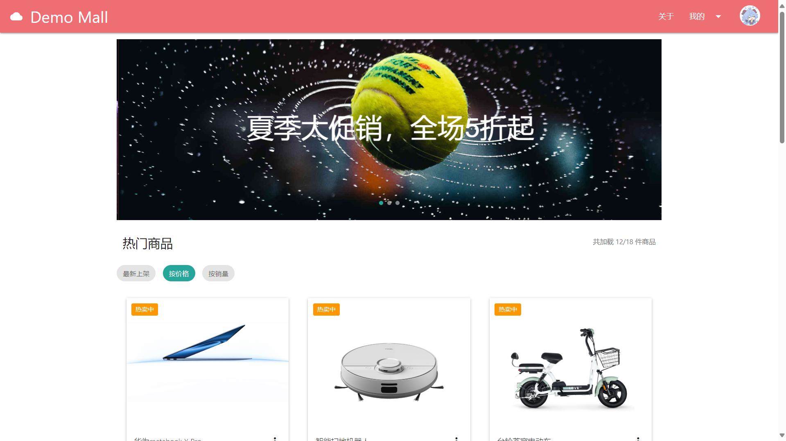

# Mall-Frontend-Demo (电商平台前端演示项目)

  
一个基于Node.js的电商平台前端演示系统，包含完整的商品展示、购物车和订单管理功能。

## 目录
- [Mall-Frontend-Demo (电商平台前端演示项目)](#mall-frontend-demo-电商平台前端演示项目)
  - [目录](#目录)
  - [功能特性](#功能特性)
    - [商品模块](#商品模块)
    - [购物车模块](#购物车模块)
    - [订单模块](#订单模块)
  - [技术栈](#技术栈)
  - [安装指南](#安装指南)
    - [系统要求](#系统要求)
    - [安装步骤](#安装步骤)
    - [项目结构](#项目结构)
  - [开发指南](#开发指南)
    - [代码规范](#代码规范)
    - [提交规范](#提交规范)

## 功能特性

### 商品模块
- 商品浏览
- 商品详情展示
- 发布新商品
- 编辑商品信息

### 购物车模块
- 添加/删除商品
- 修改商品数量
- 实时计算总价
- 批量选择操作

### 订单模块
- 订单创建流程
- 多种订单状态管理
  - 待付款（橙色）
  - 已付款（蓝色）
  - 已发货（紫色）
  - 已收货（绿色）
  - 已完成（青色）
  - 已取消（红色）
  - 已退款（灰色）
- 订单状态变更流程

## 技术栈

| 技术领域       | 使用技术                 |
|----------------|--------------------------|
| 前端框架       | Materialize CSS          |
| 前端交互       | jQuery + AJAX            |
| 后端框架       | Express.js               |
| 模板引擎       | EJS                      |
| 开发环境       | Node.js                  |

## 安装指南

### 系统要求
- Node.js 14.x 或更高版本
- npm 6.x 或更高版本

### 安装步骤

1. 克隆仓库
```bash
git clone https://github.com/cngoxu/Mall-Frontend-Demo.git
cd Mall-Frontend-Demo
```
2. 安装依赖

```bash
npm install
```

3. 启动服务

```bash
node app.js
```

4. 访问应用

- http://localhost:3000

### 项目结构
```bash
.
├── public/             # 静态资源
│   ├── images/            # 图片资源
│   ├── js/                # 脚本文件
│   └── css/               # 样式文件
├── views/              # 视图模板
│   ├── common/            # 公共组件
│   │   ├── footer.ejs        # 页脚
│   │   ├── header.ejs        # 页头
│   │   ├── navbar.ejs        # 导航栏
│   │   └── script.ejs        # 全局脚本文件
│   ├── index/             # 公共页面
│   ├── user/              # 用户相关页面
│   └── product/           # 商品相关页面
├── app.js              # 主入口文件
├── package.json        # 项目配置
└── README.md           # 项目文档
```

## 开发指南

### 代码规范

- 使用ES6语法

- 组件化开发

- 遵循RESTful API规范

###  提交规范

- feat: 新功能

- fix: bug修复

- docs: 文档更新

- style: 代码格式
